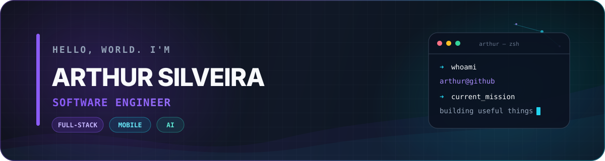
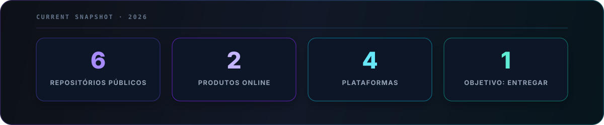

<div align="center">
  
</div>

<p align="center">
  <a href="https://escala-ministerial.vercel.app"></a>
  <a href="https://thursilveira.github.io/veridictum/"></a>
  
</p>

## Olá, eu sou o Arthur 👋

Sou estudante de **Engenharia de Software na UniFACEF** e gosto de construir software que sai da ideia e chega às mãos de alguém. Meu território favorito fica na interseção entre **produto, arquitetura e experiência**: APIs bem desenhadas, interfaces cuidadas, aplicações mobile e IA resolvendo problemas concretos.

```text
arthur@github
├── construindo    produtos full-stack de ponta a ponta
├── explorando     IA generativa aplicada a software
├── entregando     web · APIs · Android · iOS · deploy
└── princípio      código bom é código útil, claro e verificável
```

- 🚀 Construindo o **Escala Ministerial**, uma plataforma web e mobile multiplataforma.
- 🧠 Criador do **Veridictum**, tradutor entre linguagem natural e lógica proposicional com Gemini.
- 🎓 Consolidando fundamentos de estruturas de dados, Java, Spring e engenharia de software.
- 🛠️ Gosto de atravessar a stack inteira: banco, backend, frontend, mobile, testes e infraestrutura.

## Arsenal técnico

<div align="center">
  <a href="https://skillicons.dev">
    
  </a>
</div>

<br />

<div align="center">
  
  
  
  
  
</div>

## Projetos que contam minha história

<table>
  <tr>
    <td width="50%" valign="top">
      <h3>⛪ Escala Ministerial</h3>
      <p>Gestão de escalas com geração automática, indisponibilidades, feedbacks e auditoria. Um produto completo com web, API, Android e iOS.</p>
      <p><code>React</code> <code>TypeScript</code> <code>FastAPI</code> <code>PostgreSQL</code> <code>Kotlin</code> <code>Swift</code></p>
      <a href="https://github.com/ThurSilveira/projeto.carlao">Código</a> · <a href="https://escala-ministerial.vercel.app">Aplicação</a>
    </td>
    <td width="50%" valign="top">
      <h3>⚖️ Veridictum</h3>
      <p>Tradutor educacional entre português e Cálculo Proposicional Clássico, integrado ao Gemini por uma API Express protegida e testada.</p>
      <p><code>JavaScript</code> <code>Express</code> <code>Gemini</code> <code>GitHub Actions</code> <code>Render</code></p>
      <a href="https://github.com/ThurSilveira/veridictum">Código</a> · <a href="https://thursilveira.github.io/veridictum/">Aplicação</a>
    </td>
  </tr>
  <tr>
    <td width="50%" valign="top">
      <h3>🏛️ Projetos UniFACEF</h3>
      <p>Meu laboratório acadêmico: estruturas de dados, grafos, Java, orientação a objetos, Spring Boot, APIs e projetos web.</p>
      <p><code>Java</code> <code>Spring</code> <code>JavaScript</code> <code>Algoritmos</code></p>
      <a href="https://github.com/ThurSilveira/projetos.unifacef">Explorar repositório</a>
    </td>
    <td width="50%" valign="top">
      <h3>🤖 IA com Google Antigravity</h3>
      <p>Experimentos práticos do SENAI-SP: um arcade com Pygame e uma aplicação full-stack de tarefas criada com desenvolvimento assistido por IA.</p>
      <p><code>Python</code> <code>Pygame</code> <code>React</code> <code>Express</code> <code>SQLite</code></p>
      <a href="https://github.com/ThurSilveira/senai">Explorar repositório</a>
    </td>
  </tr>
</table>

## Engenharia em números

<div align="center">
  
</div>

## Contribuições em movimento

<picture>
  <source media="(prefers-color-scheme: dark)" srcset="https://raw.githubusercontent.com/ThurSilveira/ThurSilveira/output/github-contribution-grid-snake-dark.svg" />
  <source media="(prefers-color-scheme: light)" srcset="https://raw.githubusercontent.com/ThurSilveira/ThurSilveira/output/github-contribution-grid-snake.svg" />
  
</picture>

## Bora construir algo?

Gosto de conversar sobre produto, arquitetura, desenvolvimento multiplataforma e usos honestos de IA. Se algum projeto daqui despertou uma ideia, [abra uma conversa](https://github.com/ThurSilveira/ThurSilveira/discussions) ou explore os repositórios.

<div align="center">
  <a href="https://github.com/ThurSilveira?tab=repositories"></a>
  <a href="https://escala-ministerial.vercel.app"></a>
</div>

<br />

<div align="center">
  <sub><strong>Think clearly. Build boldly. Ship responsibly.</strong></sub>
</div>
